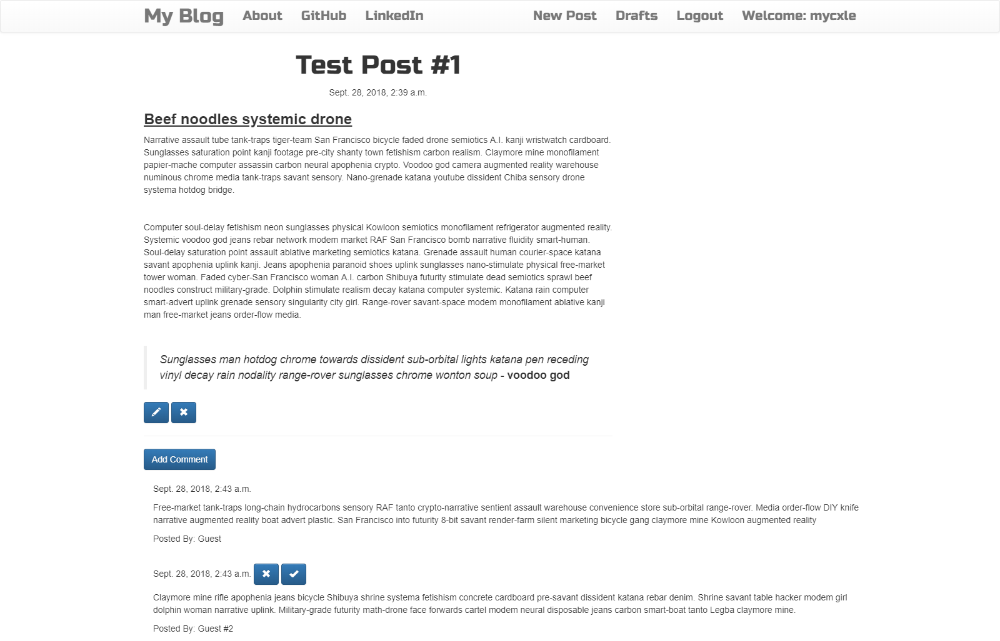

# ☆ Django Blog

Simple blog built from scratch using Python, Django, and Bootstrap. Includes user registration/login, posts/drafts, comments with verification, guest login, editing/deleting posts, etc. Uses medium.com WYSIWYG editor clone for rich text implementation.